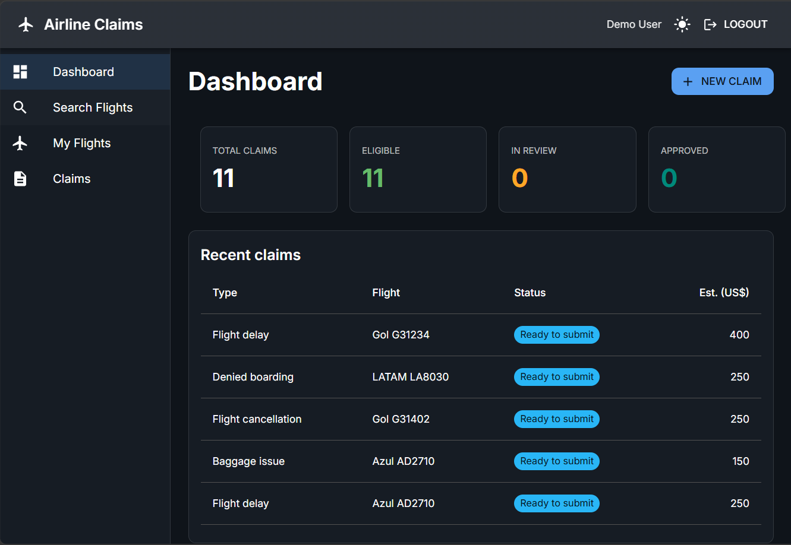
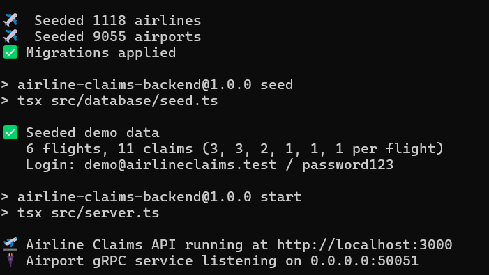
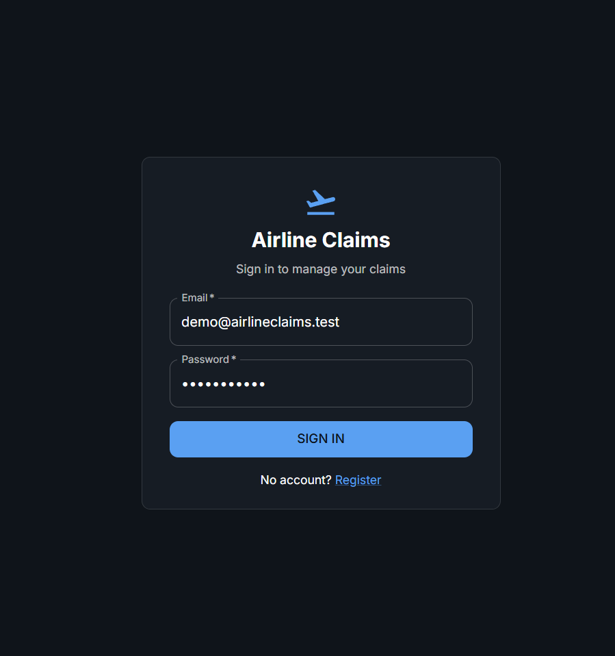
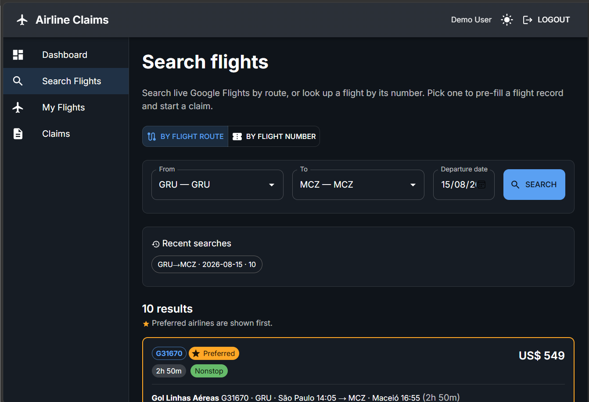
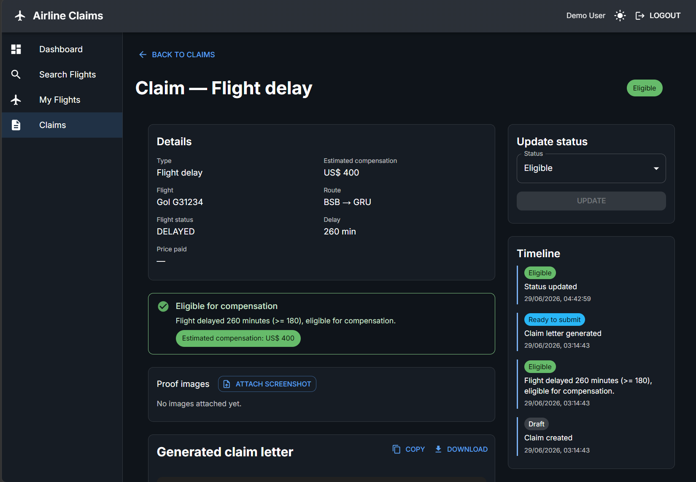
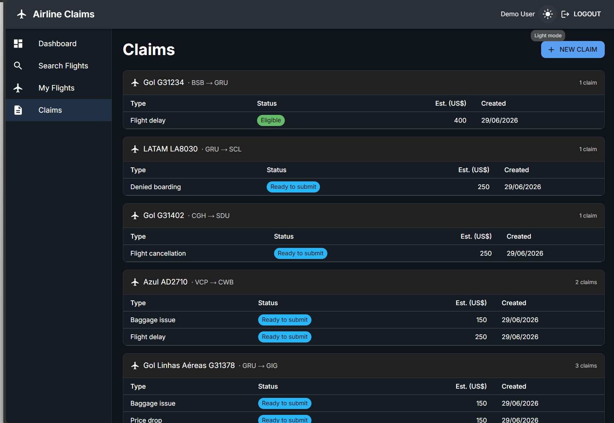
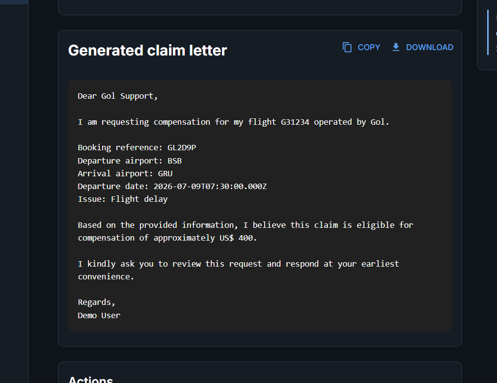

# Airline Claims POC ✈️

A small full-stack web app inspired by [getjetback.com](https://getjetback.com)
for managing airline compensation claims. Users register, record flights, file
claims, check eligibility, generate a claim letter, and track claim status —
plus a **real flight search** powered by Google Flights' internal endpoint
(ported from the `fli` library) that lets users find flights by route + date and
turn a result into a flight record.

<p align="center">
  
</p>

> This project is a POC inspired by airline claim platforms. It does **not**
> submit claims directly to airlines. It simulates the claim workflow: data
> collection, eligibility check, letter generation, and status tracking.
> SQLite is used to simplify local development.

---


<summary><strong>📑 Summary</strong></summary>

- [Development story line](#development-story-line) — why each part is built the way it is
- [Stack](#stack) — runtimes, frameworks and drivers
- [First run](#first-run) — get the app running in two terminals
- [Optional enhancements (not built)](#optional-enhancements-not-built) — what a v2 could add
- [Screenshots](#screenshots) — the app in action

Per-app docs: **[backend README](backend/README.md)** · **[frontend README](frontend/README.md)**


<details>
<summary><strong>🛠️ Development story line</strong></summary>

### Backend
- Airports and Airlines:
Searching less depences in the development i searched about a datasets of theirs, and i found free on the internet.
- Font of the flights:
Flight search using the Google Flights doing a scrap, i choosed use this searching dont spell some money with paid API's, but can be changed and use anothers API's, in accordance with the expected response format.
- Fast hybrid API search:
To implement the dynamic and fast search in the front, i implemented a hybrid backend API, using a REST and a gRPC API's, cause the search method need a more dynamic, efficient and cheap method, resulting in savings on data traffic and the user can search by iata, city name of airport name.
- Avoid search API abuse:
implemented a search limitation based in:
```
when user do some search airport X to airport Y
check in the database if got some search exactly like that 
and if in the last 10 minutes
if yes return the same result
```
now is using the sqlite, because is a POC, but you can put in a REDIS,Valkey....
- Save images:
Right now this API is saving the Base64 of the image who the user is sedding, but in production need to change to another service, is doing that right now to save the evidence of the user.
- Authentication:
Register/login hash the password with Node's built-in crypto.scrypt (salted) and return a JWT (@elysiajs/jwt); protected routes run requireAuth, which verifies the bearer token and loads the user, so every query is scoped to that user.
- Eligibility rules:
This is a mix of EU rules and common rules in some countrys, if you want to put in production, need to search the specify rules, you can seed in rules-origin.md .
### Front
- Usability
With usability in mind, I tried to make the first screen for a logged-in user a summary of the all claims of the user and their status.
- Search methods:
To enable users to search for and purchase tickets, a search function based on destinations and flight number was implemented.
- Improved visualization
aiming to make things more organized, in "My Flights" and "Claims" the user see the claims grouped by the flight and not several claim's spread in the screen.
- Price claim:
the plataform can check if the price had dropped, the user need to but the price who he paid, and we do the validation if se result is no he can put a screenshot of evidence.
- Claim history:
At now the person can see the history of the Claims, but this is manual right now.
- Automate letter:
Generate a letter to the user send to the flight company.

</details>

<details>
<summary><strong>📦 Stack</strong></summary>

| Layer    | Tech                                                                              |
| -------- | --------------------------------------------------------------------------------- |
| Backend  | **Node.js** · Elysia (via `@elysiajs/node`) · SQLite (`better-sqlite3`) · Drizzle ORM · JWT (`@elysiajs/jwt` + `crypto.scrypt`) · gRPC airport search (`@grpc/grpc-js`) · Google Flights search (`fetch`) · Vitest |
| Frontend | **Node.js** · Vite 7 · React 18 · TypeScript · Material UI 6 (light/dark) · React Router 6 · Axios |

The whole project runs on **Node.js 20.19+** (developed on Node 24) and **npm** —
no other runtime is needed. TypeScript runs directly with
[`tsx`](https://github.com/privatenumber/tsx) (no build step for local dev), and
the search layer is hybrid: REST for everything, plus a gRPC service for fast
type-ahead airport lookup by IATA, city or airport name.

> ℹ️ The original plan specced the backend for Bun; it has been **ported to run
> entirely on Node.js**. No Bun installation is required anywhere.

</details>

<details>
<summary><strong>🚀 First run</strong></summary>

Two terminals. Backend first, then frontend.

**1. Backend** — `http://localhost:3000` (gRPC airport service on `:50051`)

```bash
cd backend
npm install
cp .env.example .env          # adjust if needed
npm run start:first           # migrate → seed demo data → start
```

`start:first` is the one-command bootstrap. After the first run, just use
`npm run dev`.

**2. Frontend** — `http://localhost:5173`

```bash
cd frontend
npm install
cp .env.example .env          # VITE_API_URL=http://localhost:3000
npm run dev
```
Wait this console to do the next step:

<p align="left">
  
</p>

Then open the app and sign in with the demo account:

```
demo@airlineclaims.test / password123
```

Flight search works out of the box — the **Search flights** page makes a real
request to Google Flights' internal endpoint. Because that endpoint is
undocumented, Google may occasionally rate-limit or block it; when that happens
the API returns HTTP 502 with a clear message.

See **[backend/README.md](backend/README.md)** and
**[frontend/README.md](frontend/README.md)** for per-app detail, API reference,
and tests.

</details>

<details>
<summary><strong>💡 Optional enhancements (not built)</strong></summary>

PDF export of the letter, real file upload, admin dashboard, email draft,
airline contact DB, mock airline submission endpoint, AI-generated claim text,
multi-language support.

</details>

<details>
<summary><strong>🖼️ Screenshots</strong></summary>

| | |
| --- | --- |
|  |  |
|  |  |
|  |  |

</details>
